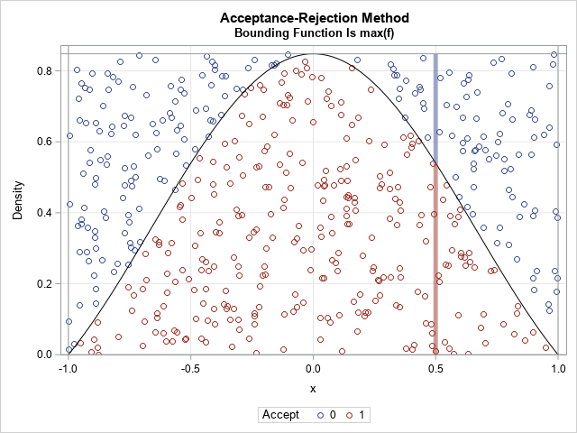
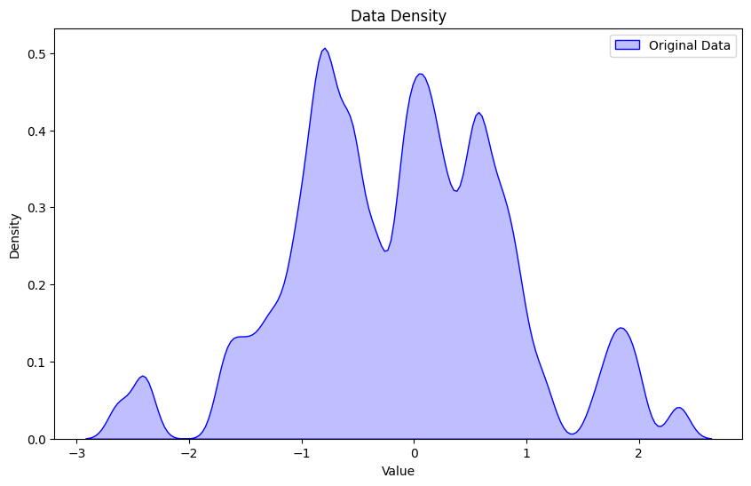
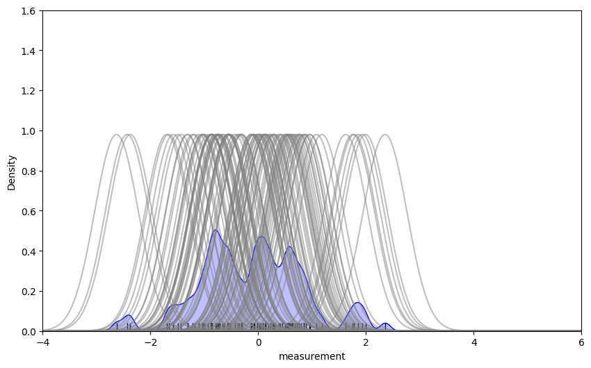
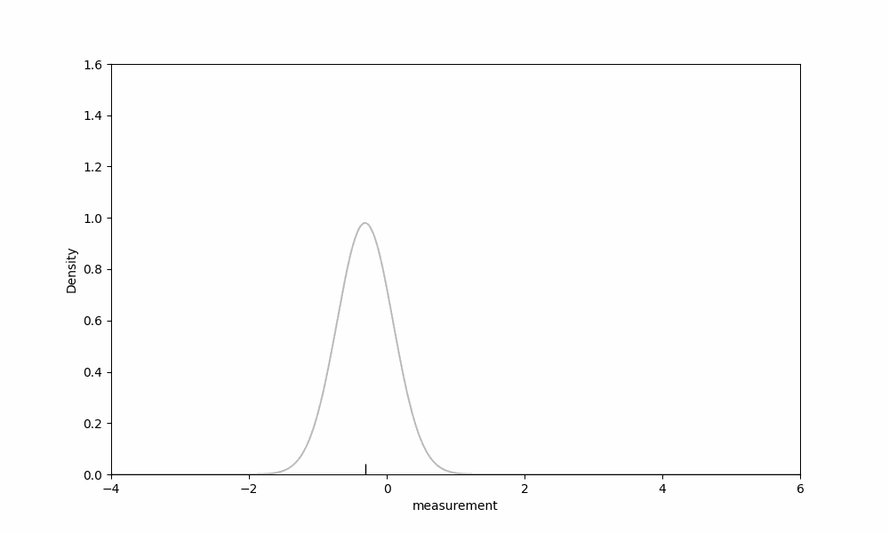
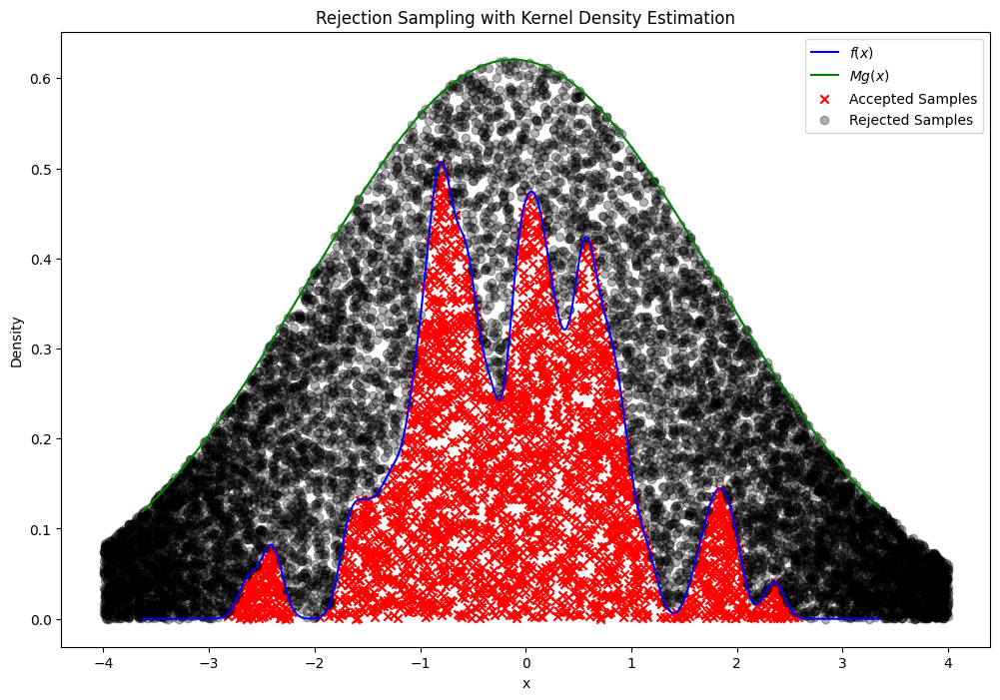
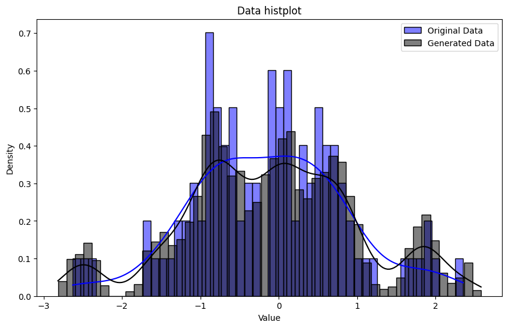
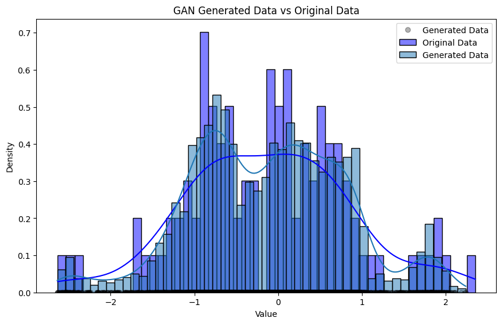
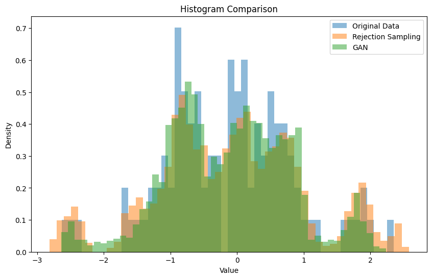
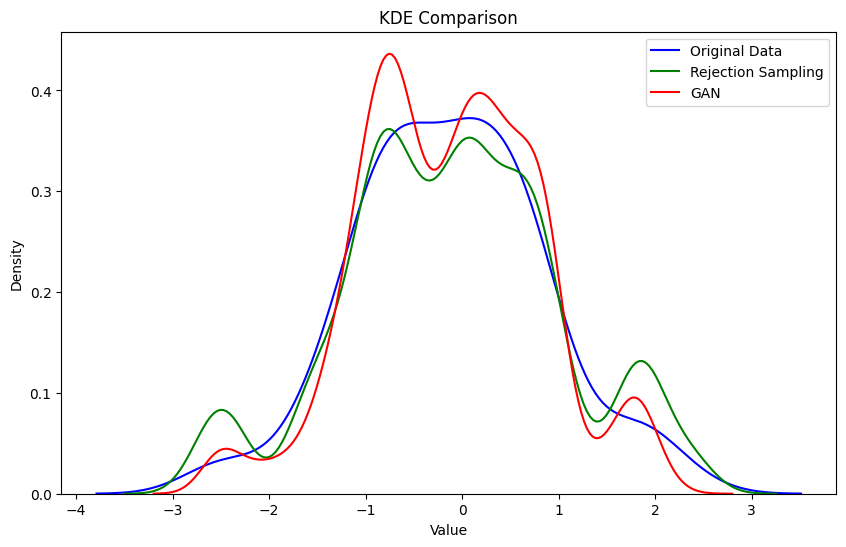

# 傳統的統計生成服從分配資料的方法

### 拒絕采樣的詳細數學推理

拒絕采樣（Rejection Sampling）是一種從覆雜分布中生成樣本的方法。下面我們詳細推理如何使用拒絕采樣從核密度估計函數中生成樣本，並解釋哪些樣本會被拒絕，哪些會被接受。

#### 1. 核密度估計

假設我們有一個樣本數據集 $\{x_1, x_2, \ldots, x_n\}$。我們可以使用核密度估計（KDE）來估計該數據集的概率密度函數 $f(x)$：

$$ \hat{f}(x) = \frac{1}{n h} \sum_{i=1}^n K\left(\frac{x - x_i}{h}\right) $$

其中：
- $\hat{f}(x)$ 是在點 $x$ 處的密度估計值。
- $K$ 是核函數，常見的核函數有高斯核（Gaussian Kernel）：
  $$ K(u) = \frac{1}{\sqrt{2\pi}} e^{-0.5 u^2} $$
- $h$ 是帶寬參數。

#### 2. 拒絕采樣的步驟

1. **選擇包絡函數 $g(x)$** ：
   選擇一個簡單的包絡函數 $g(x)$ 和一個常數 $M$，使得對於所有 $x$ 都有 $M g(x) \geq f(x)$。

2. **采樣 $x$ 和 $u$** ：
   - 從包絡函數 $g(x)$ 中采樣 $x'$。
   - 從均勻分布 $U(0, M g(x'))$ 中采樣 $u$。

3. **接受-拒絕判別** ：
   - 如果 $u \leq f(x')$，則接受 $x'$ 作為樣本。
   - 否則，拒絕 $x'$ 並重新采樣。

#### 3. 數學推理和接受概率

設 $X$ 和 $U$ 分別服從 $U(0,1)$ 和 $U(0,1)$，形成樣本對 $Z = \{(x_1, u_1), (x_2, u_2), \ldots\}$。接受判別條件為：

$$ u_i \leq \frac{f(x_i)}{M g(x_i)} $$

對於每個樣本點 $x_i$ 和 $u_i$，我們有：
- 如果 $u_i \leq \frac{f(x_i)}{M g(x_i)}$，則接受 $x_i$。
- 否則，拒絕 $x_i$。

#### 4. 核密度估計和包絡函數示例

假設我們使用高斯核函數來估計密度 $f(x)$，選擇正態分布 $g(x)$ 作為包絡函數。我們可以設置包絡函數 $g(x)$ 和常數 $M$ 使其覆蓋密度函數 $f(x)$。

### 解釋和總結

1. **核密度估計**：使用核密度估計（KDE）得到目標密度函數 $f(x)$。
2. **選擇包絡函數和常數**：選擇正態分布 $g(x)$ 作為包絡函數，並確定常數 $M$ 使得 $M g(x) \geq f(x)$。
3. **拒絕采樣**：從 $g(x)$ 中采樣 $x'$，從均勻分布 $U(0, M g(x'))$ 中采樣 $u$，如果 $u \leq f(x')$，則接受 $x'$ 作為樣本。
4. **結果**：通過可視化展示被接受和被拒絕的樣本點，並比較原始數據和生成數據的統計特性。

通過這個過程，我們能夠生成符合目標分布 $f(x)$ 的樣本，並通過拒絕采樣方法有效地生成與原始數據分布相似的新數據。




```python
# 生成兩個正態分布數據
data1 = np.random.normal(loc=-1, scale=1, size=100)
data2 = np.random.normal(loc=1, scale=0.03, size=100)

# 將兩個正態分布數據相加
data = data1 + data2


# 可視化生成的數據
plt.figure(figsize=(10, 6))
sns.kdeplot(data, fill=True, label='Original Data', color='blue', bw_method=0.1)
plt.legend()
plt.xlabel('Value')
plt.ylabel('Density')
plt.title('Data Density')
plt.show()
```


    

    


# 可視化繪製核密度估計圖


```python
import numpy as np
import matplotlib.pyplot as plt
import seaborn as sns
from scipy.stats import norm
from matplotlib.animation import FuncAnimation, PillowWriter

# 設置x範圍
x = np.linspace(-6, 6, 1000)

# 計算帶寬
bandwidth = 1.06 * np.std(data) * len(data) ** (-1 / 5)

# 創建圖形
fig, ax = plt.subplots(figsize=(10, 6))

def update(frame):
    ax.clear()
    ax.set_xlim(-4, 6)
    ax.set_ylim(0, 1.6)
    ax.set_xlabel('measurement')
    ax.set_ylabel('Density')
    
    # 繪製核密度估計圖
    if frame > 0:
        sns.kdeplot(data[:frame+1], fill=True, ax=ax, color='blue', bw_method=0.1)
    
    # 添加數據點
    sns.rugplot(data[:frame+1], color='black', ax=ax)
    
    # 繪製每個數據點的核函數
    for point in data[:frame+1]:
        kernel = norm(point, bandwidth).pdf(x)
        ax.plot(x, kernel, color='grey', alpha=0.5)

# 創建動畫
ani = FuncAnimation(fig, update, frames=len(data), repeat=False)

# 保存為GIF
ani.save("kde_animation.gif", writer=PillowWriter(fps=2))

plt.show()

```


    

    




# Rejection Sampling with Kernel Density Estimation


```python
from scipy.stats import gaussian_kde, norm

# 使用數據估計核密度函數
kde = gaussian_kde(data, bw_method=0.1)
f = kde.evaluate  # 核密度估計函數


M = 3  # 選擇一個適當的 M 值，使 M * g(x) >= f(x) 對於所有 x 成立
# 選擇包絡函數 g(x) 和常數 M
g = lambda x: norm.pdf(x, loc=np.mean(data), scale=np.std(data)*2)  # 使用正態分布作為包絡函數

# 設置 x 軸範圍
x = np.linspace(min(data) - 1, max(data) + 1, 3000)

# 計算 f(x) 和 M g(x)
f_x = kde(x)
g_x = M * g(x)

# 拒絕采樣生成數據
num_samples = 3000
samples = []
rejected_samples = []
while len(samples) < num_samples:
    x_sample = np.random.uniform(-4, 4)  # 從均勻分布中采樣
    u = np.random.uniform(0, M * g(x_sample))  # 從均勻分布中采樣
    if u <= kde.evaluate([x_sample])[0]:
        samples.append((x_sample, u, 1))  # 1表示接受
    else:
        rejected_samples.append((x_sample, u, 0))  # 0表示拒絕

# 轉換為NumPy數組
samples = np.array(samples)
rejected_samples = np.array(rejected_samples)

# 可視化原始數據、包絡函數、核密度估計和采樣數據
plt.figure(figsize=(12, 8))
plt.plot(x, f_x, label='$f(x)$', color='blue')
plt.plot(x, g_x, label='$Mg(x)$', color='green')


# 繪制接受和拒絕的樣本點
plt.scatter(samples[:, 0], samples[:, 1], color='red', marker='x', label='Accepted Samples')
plt.scatter(rejected_samples[:, 0], rejected_samples[:, 1], color='black', marker='o', label='Rejected Samples', alpha=0.3)

plt.legend()
plt.xlabel('x')
plt.ylabel('Density')
plt.title('Rejection Sampling with Kernel Density Estimation')
plt.show()
```


    

    


```python
# 可視化生成的數據
plt.figure(figsize=(10, 6))
sns.histplot(data, bins=50, kde=True, label='Original Data', color='blue', stat="density", alpha=0.5)
sns.histplot(samples[:, 0], bins=50, kde=True, label='Generated Data', color='black', stat="density", alpha=0.5)

plt.legend()
plt.xlabel('Value')
plt.ylabel('Density')
plt.title('Data histplot')
plt.show()
```


    

    


# 生成對抗網絡（Generative Adversarial Networks，GANs）

生成對目標分布進行建模並生成新樣本的方法中，生成對抗網絡（Generative Adversarial Networks，GANs）是一種非常有效的方法。以下是如何使用GAN生成服從目標分布的數據的詳細數學推理和示例代碼。

### 生成對抗網絡（GAN）的基本概念

GAN由兩個神經網絡組成：生成器（Generator）和判別器（Discriminator）。生成器試圖生成逼真的樣本，而判別器則試圖區分真實樣本和生成的樣本。這兩個網絡通過對抗訓練，相互提升。

#### 1. 生成器（Generator）

生成器 $G$ 接受一個隨機噪聲向量 $z$ 作為輸入，並輸出生成的樣本 $G(z)$。生成器的目標是生成盡可能接近真實數據分布的樣本。

$$ G(z; \theta_G) $$

其中 $\theta_G$ 是生成器的參數。

#### 2. 判別器（Discriminator）

判別器 $D$ 接受一個樣本作為輸入，輸出一個標量值，表示該樣本來自真實數據分布的概率。判別器的目標是盡可能準確地區分真實樣本和生成樣本。

$$ D(x; \theta_D) $$

其中 $\theta_D$ 是判別器的參數。

#### 3. GAN的訓練目標

GAN的訓練目標是使得生成器和判別器之間達到一個動態的平衡。生成器試圖欺騙判別器，使其認為生成樣本是真實的，而判別器試圖準確區分真實樣本和生成樣本。

GAN的目標函數可以表示為：

$$ \min_G \max_D V(D, G) = \mathbb{E}_{x \sim p_{\text{data}}(x)}[\log D(x)] + \mathbb{E}_{z \sim p_z(z)}[\log (1 - D(G(z)))] $$

### GAN的訓練步驟

1. **初始化生成器和判別器的參數 $\theta_G$ 和 $\theta_D$**。
2. **對於每次訓練叠代**：
   - **判別器訓練**：
     1. 從真實數據分布中采樣一批真實樣本 $x^{(i)} \sim p_{\text{data}}(x)$。
     2. 從噪聲分布中采樣一批噪聲向量 $z^{(i)} \sim p_z(z)$。
     3. 計算判別器的損失並更新參數 $\theta_D$：
        $$ L_D = -\left( \mathbb{E}_{x \sim p_{\text{data}}(x)}[\log D(x)] + \mathbb{E}_{z \sim p_z(z)}[\log (1 - D(G(z)))] \right) $$
   - **生成器訓練**：
     1. 從噪聲分布中采樣一批噪聲向量 $z^{(i)} \sim p_z(z)$。
     2. 計算生成器的損失並更新參數 $\theta_G$：
        $$ L_G = -\mathbb{E}_{z \sim p_z(z)}[\log D(G(z))] $$


```python
import torch
import torch.nn as nn
import torch.optim as optim
from torch.utils.data import DataLoader, TensorDataset
import numpy as np
import matplotlib.pyplot as plt

# 生成模擬數據
data = data.astype(np.float32)
dataset = TensorDataset(torch.tensor(data).unsqueeze(1))
dataloader = DataLoader(dataset, batch_size=64, shuffle=True)

# 查看DataLoader的批次大小信息
for batch_idx, (batch_data,) in enumerate(dataloader):
    print(f'Batch {batch_idx + 1}:')
    print(f'  Batch size: {batch_data.size(0)}')
    print(f'  Data: {batch_data.shape}\n')

    # 只查看第一個批次的大小
    break


# 生成器網絡
class Generator(nn.Module):
    def __init__(self):
        super(Generator, self).__init__()
        self.model = nn.Sequential(
            nn.Linear(10, 128),
            nn.ReLU(),
            nn.Linear(128, 1)
        )

    def forward(self, x):
        return self.model(x)

# 判別器網絡
class Discriminator(nn.Module):
    def __init__(self):
        super(Discriminator, self).__init__()
        self.model = nn.Sequential(
            nn.Linear(1, 128),
            nn.ReLU(),
            nn.Linear(128, 1),
            nn.Sigmoid()
        )

    def forward(self, x):
        return self.model(x)

# 初始化生成器和判別器
generator = Generator()
discriminator = Discriminator()

# 損失函數和優化器
criterion = nn.BCELoss()
optimizer_G = optim.Adam(generator.parameters(), lr=0.001)
optimizer_D = optim.Adam(discriminator.parameters(), lr=0.001)

# 訓練GAN
num_epochs = 10000
for epoch in range(num_epochs):
    for real_data, in dataloader:
        batch_size = real_data.size(0)

        # 訓練判別器
        real_labels = torch.ones(batch_size, 1)
        fake_labels = torch.zeros(batch_size, 1)

        outputs = discriminator(real_data)
        d_loss_real = criterion(outputs, real_labels)
        real_score = outputs

        z = torch.randn(batch_size, 10)
        fake_data = generator(z)
        outputs = discriminator(fake_data.detach())
        d_loss_fake = criterion(outputs, fake_labels)
        fake_score = outputs

        d_loss = d_loss_real + d_loss_fake
        optimizer_D.zero_grad()
        d_loss.backward()
        optimizer_D.step()

        # 訓練生成器
        z = torch.randn(batch_size, 10)
        fake_data = generator(z)
        outputs = discriminator(fake_data)
        g_loss = criterion(outputs, real_labels)

        optimizer_G.zero_grad()
        g_loss.backward()
        optimizer_G.step()

    if (epoch+1) % 1000 == 0:
        print(f'Epoch [{epoch+1}/{num_epochs}], d_loss: {d_loss.item():.4f}, g_loss: {g_loss.item():.4f}, D(x): {real_score.mean().item():.4f}, D(G(z)): {fake_score.mean().item():.4f}')

# 生成新數據
z = torch.randn(3000, 10)
generated_data = generator(z).detach().numpy()


```

    Epoch [1000/10000], d_loss: 1.1902, g_loss: 0.7725, D(x): 0.5841, D(G(z)): 0.4455
    Epoch [2000/10000], d_loss: 1.3700, g_loss: 0.7383, D(x): 0.4866, D(G(z)): 0.4768
    Epoch [3000/10000], d_loss: 1.3625, g_loss: 0.7493, D(x): 0.5053, D(G(z)): 0.4907
    Epoch [4000/10000], d_loss: 1.3822, g_loss: 0.7224, D(x): 0.5113, D(G(z)): 0.5020
    Epoch [5000/10000], d_loss: 1.3662, g_loss: 0.6821, D(x): 0.5105, D(G(z)): 0.4981
    Epoch [6000/10000], d_loss: 1.3437, g_loss: 0.6927, D(x): 0.4943, D(G(z)): 0.4633
    Epoch [7000/10000], d_loss: 1.4030, g_loss: 0.6913, D(x): 0.4985, D(G(z)): 0.5036
    Epoch [8000/10000], d_loss: 1.3798, g_loss: 0.7404, D(x): 0.4975, D(G(z)): 0.4937
    Epoch [9000/10000], d_loss: 1.3917, g_loss: 0.6806, D(x): 0.5017, D(G(z)): 0.5033
    Epoch [10000/10000], d_loss: 1.3883, g_loss: 0.7084, D(x): 0.4995, D(G(z)): 0.5000
    


```python
# 可視化生成的數據
plt.figure(figsize=(10, 6))
sns.histplot(data, bins=50, kde=True, label='Original Data', color='blue', stat="density", alpha=0.5)
sns.histplot(generated_data, bins=50, kde=True, label='Generated Data', color='black', stat="density", alpha=0.5)

plt.legend()
plt.xlabel('Value')
plt.ylabel('Density')
plt.title('GAN Generated Data vs Original Data')
plt.show()
```


    

    


# 結果比較


```python
import numpy as np
import matplotlib.pyplot as plt
import seaborn as sns
from scipy.stats import ks_2samp
from scipy.spatial.distance import jensenshannon


rejection_data = samples[:, 0]
gan_data = generated_data.reshape(1,-1)[0]

# KS 檢驗
ks_stat_rejection, ks_p_value_rejection = ks_2samp(data, rejection_data)
ks_stat_gan, ks_p_value_gan = ks_2samp(data, gan_data)

print(f'KS Statistic for Rejection Sampling: {ks_stat_rejection}, P-Value: {ks_p_value_rejection}')
print(f'KS Statistic for GAN: {ks_stat_gan}, P-Value: {ks_p_value_gan}')

# JS 散度
hist_real, bin_edges = np.histogram(data, bins=100, density=True)
hist_rejection, _ = np.histogram(rejection_data, bins=bin_edges, density=True)
hist_gan, _ = np.histogram(gan_data, bins=bin_edges, density=True)

js_divergence_rejection = jensenshannon(hist_real, hist_rejection)
js_divergence_gan = jensenshannon(hist_real, hist_gan)

print(f'JS Divergence for Rejection Sampling: {js_divergence_rejection}')
print(f'JS Divergence for GAN: {js_divergence_gan}')

# 直方圖比較
plt.figure(figsize=(10, 6))
plt.hist(data, bins=50, alpha=0.5, label='Original Data', density=True)
plt.hist(rejection_data, bins=50, alpha=0.5, label='Rejection Sampling', density=True)
plt.hist(gan_data, bins=50, alpha=0.5, label='GAN', density=True)
plt.legend()
plt.xlabel('Value')
plt.ylabel('Density')
plt.title('Histogram Comparison')
plt.show()

# KDE 比較
plt.figure(figsize=(10, 6))
sns.kdeplot(data, label='Original Data', color='blue')
sns.kdeplot(rejection_data, label='Rejection Sampling', color='green')
sns.kdeplot(gan_data, label='GAN', color='red')
plt.legend()
plt.xlabel('Value')
plt.ylabel('Density')
plt.title('KDE Comparison')
plt.show()

# 定量統計特征比較
print(f'Original Data: Mean={np.mean(data)}, Std={np.std(data)}')
print(f'Rejection Sampling: Mean={np.mean(rejection_data)}, Std={np.std(rejection_data)}')
print(f'GAN: Mean={np.mean(gan_data)}, Std={np.std(gan_data)}')

```

    KS Statistic for Rejection Sampling: 0.06066666666666667, P-Value: 0.8485322883660972
    KS Statistic for GAN: 0.03, P-Value: 0.9999803787828127
    JS Divergence for Rejection Sampling: 0.3366245077635384
    JS Divergence for GAN: 0.34013228589627814
    


    

    


    

    


    Original Data: Mean=-0.12342249602079391, Std=0.9643147587776184
    Rejection Sampling: Mean=-0.10025537583378039, Std=1.1181501042165314
    GAN: Mean=-0.13069593906402588, Std=0.9237544536590576
    

可以看到其實結果是非常相近的


### Kolmogorov-Smirnov (KS) 檢驗

- **Rejection Sampling**:
  - KS Statistic: 0.0607
  - P-Value: 0.8485

- **GAN**:
  - KS Statistic: 0.03
  - P-Value: 0.99998

### Jensen-Shannon (JS) 散度

- **Rejection Sampling**:
  - JS Divergence: 0.3366

- **GAN**:
  - JS Divergence: 0.3401

### 解釋

1. **KS 檢驗**：
   - KS 檢驗的統計量越小，P值越大，表明兩個分布越相似。
   - GAN生成的數據與原始數據的KS Statistic更小，P值更大，表明GAN生成的數據與原始數據更相似。

2. **JS 散度**：
   - JS 散度數值越小，表示兩個分布越相似。
   - Rejection Sampling生成的數據的JS Divergence略小於GAN生成的數據，這意味著從JS散度來看，Rejection Sampling生成的數據與原始數據的分布更相似一些。


# Rejection Sampling 和 GAN（Generative Adversarial Networks）這兩種方法的優勢：

### Rejection Sampling

**優勢**：

1. **簡單易實現**：
   - Rejection Sampling 的算法相對簡單，易於實現和理解。

2. **理論基礎紮實**：
   - Rejection Sampling 基於嚴格的概率論基礎，能夠生成符合指定概率分布的數據，理論上是無偏的。

3. **適用於低維數據**：
   - 在低維數據生成任務中（如一維或二維），Rejection Sampling 的效率和效果都比較好。

4. **不依賴覆雜模型**：
   - 不需要訓練覆雜的模型，直接利用概率分布和密度函數進行采樣。

**缺點**：

1. **效率低下**：
   - 在高維數據中，找到合適的包絡函數 \( g(x) \) 變得非常困難，導致采樣效率極低。

2. **依賴密度函數**：
   - 需要已知目標分布的密度函數，對於某些覆雜分布可能無法計算或近似。

### Generative Adversarial Networks (GANs)

**優勢**：

1. **高效處理高維數據**：
   - GANs 能夠高效地處理高維數據（如圖像、音頻等），生成高質量的覆雜樣本。

2. **靈活性強**：
   - 通過調整生成器和判別器的結構，可以適應各種類型的數據生成任務。

3. **無需顯式密度函數**：
   - 不需要顯式地計算目標分布的密度函數，只需要樣本數據進行訓練。

4. **學習數據分布的隱含特征**：
   - GANs 能夠學習數據分布的隱含特征，並生成逼真的樣本，適用於生成式模型的廣泛應用。

**缺點**：

1. **訓練不穩定**：
   - GANs 的訓練過程可能會出現不穩定性，如模式崩潰（mode collapse），導致生成樣本的多樣性不足。

2. **難以評價**：
   - 生成樣本的質量難以評價，常用的評價指標如 Inception Score 和 Fréchet Inception Distance 也有局限性。

3. **計算資源需求高**：
   - 訓練 GANs 需要大量的計算資源和數據，訓練時間較長。

### 總結

**Rejection Sampling** 適用於理論基礎紮實的低維數據生成任務，方法簡單但在高維數據中效率低下。適用於需要精確符合某一已知分布的小規模數據生成。

**GANs** 則適用於覆雜、高維數據生成任務，如圖像、音頻等。盡管訓練不穩定且評價困難，但它們的靈活性和強大的生成能力使其在生成式模型中占據重要地位。

選擇哪種方法主要取決於具體的應用場景、數據特性和生成任務的需求。對於低維、已知分布的數據，Rejection Sampling 是一個簡單且有效的選擇；對於高維、覆雜的數據，GANs 更為適用。


```python

```
